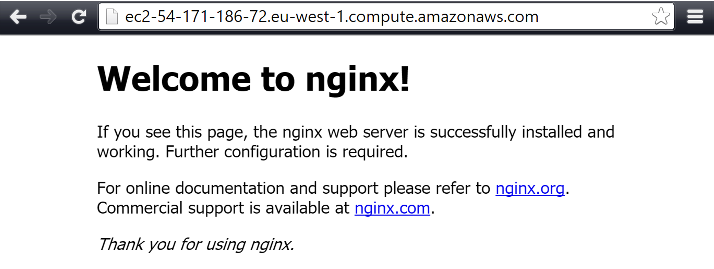
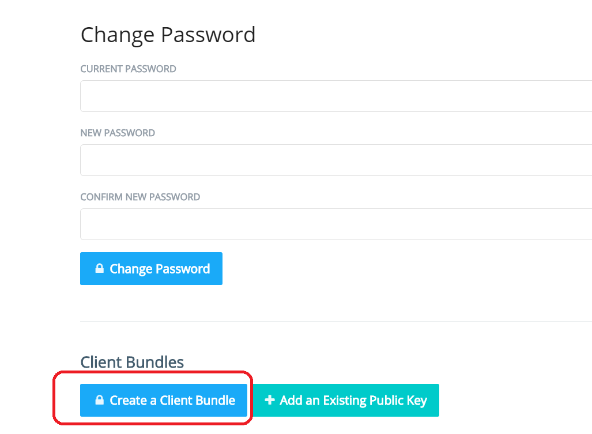
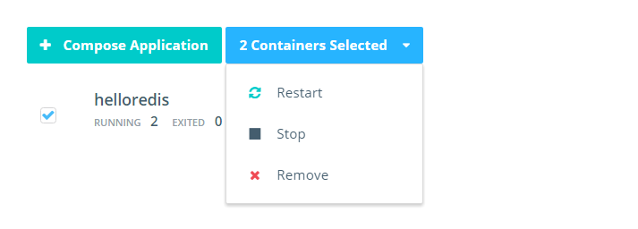
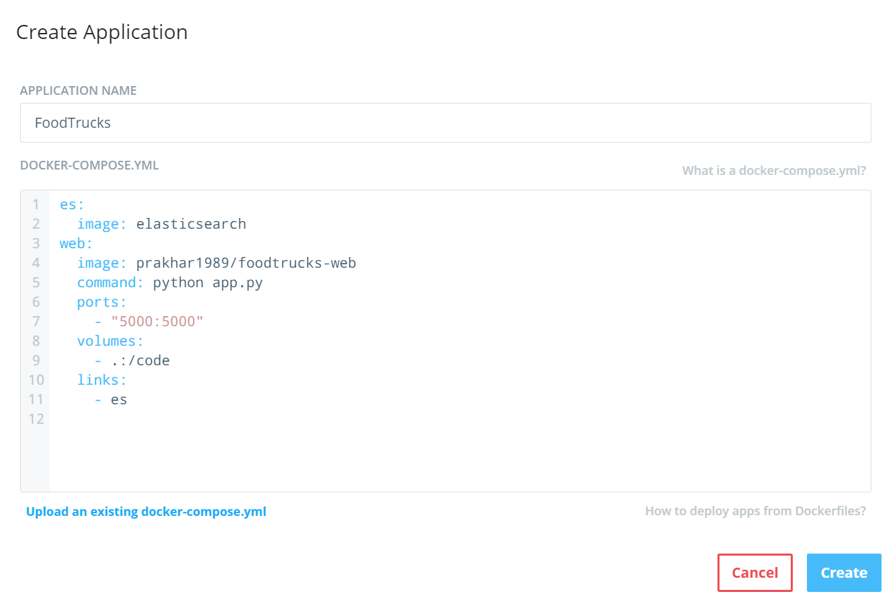
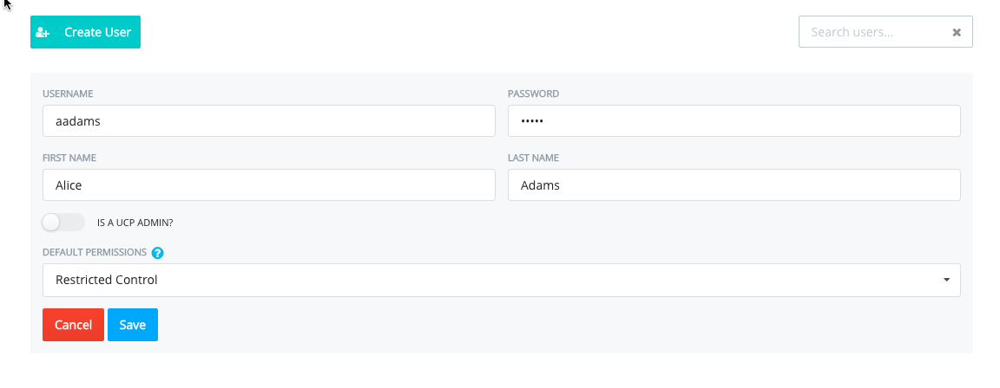
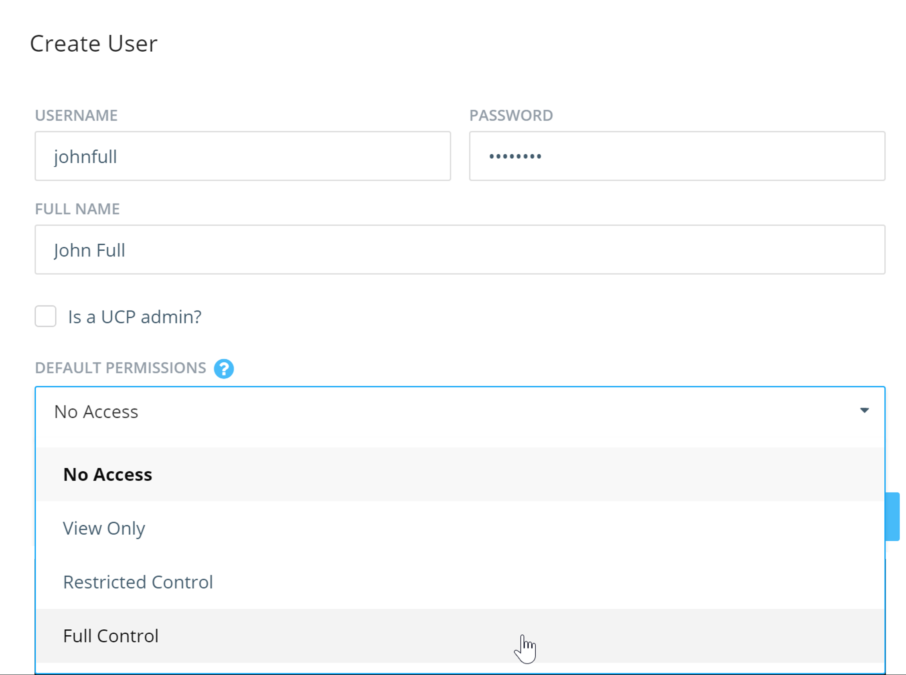
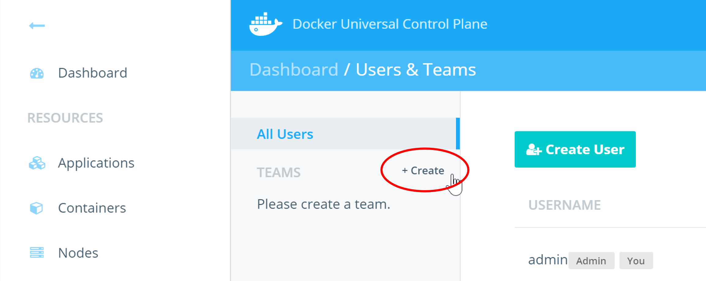
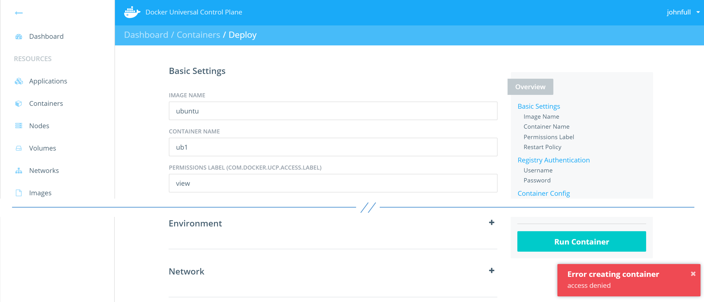

# Docker Datacenter

These tasks for hands-on labs will take you through a typical workflow for Docker Datacenter.
From install, through deploying various applications, and setting up common role-based access control
you will be able to quickly familiarize yourself with the features of Docker Universal Control Plane.

> **Difficulty**: Beginner

> **Time**: Approximately 45 minutes

> **Tasks**:
>
> * [Prerequisites](#prerequisites)
> * [Install UCP Controller](#install-ucp-controller)
> * [Attach UCP Nodes](#attach-ucp-nodes)


## <a name="prerequisites"></a>Prerequisites

- TODO: Prereqs here

## <a name="install-ucp-controller"></a>Task 1: Install UCP Controller
## <a name="attach-ucp-nodes"></a>Task 2: Attach UCP Nodes

## <a name="deploy-a-container"></a>Task 3: Deploy a container

In this task you will use USP to deploy a web server from the official NGINX image. The following steps will walk you through this process.

1. Deploy a container
2. Test the deployment

## Step 1 - Deploy a container
In this step you will launch a new container based on the NGINX image using the UCP web UI.

1. If you have not already done so, log in to UCP with the built-in **admin** account.

2. Click the **Containers** link on left navigation bar.

3. Click on **+ Deploy Container** button.

4. Fill out the Basic Settings as shown below:


5. Expand the **Network** section on the same page and configure the following port mappings:


6. Hit the **Run Container** button on the right side panel.

  When the operation completes you will see your container listed as shown below. The green circle to the left of the container indicates that the container is in the **running** state.


7. Click on the row where the container is listed to see the full container details. Then scroll down to the **Ports** section of the page to check the port mappings.


## Step 2 - Quick Test

In this step you will use your web browser to access the home page of the **nginx_server** container started in the previous step.

In order to access the NGINX container from your web browser you will need the DNS hostname of the node that the container is running on.

1. First, let's take a look at the node our **nginx_server** container is running on. In the container details, you can find the node information.


In this particular example, the **nginx_server** container is running on the **node--1** node with an IP of 10.0.18.236. However, this is the private IP address of the node and you will not be able to use this address to connect to the web server. Locate the public IP, or public DNS name, of the node from the lab details you received (each lab machine you have will have a public and priave IP and DNS).

2. Go to your web browser and enter the public IP or public DNS name of the node that the **nginx_server** container is running on.

You will see the NGINX welcome page.



You have successfully launched a web container using the Docker UCP web UI.# Task 4 - Deploy a simple application on UCP

## Pre-requisites

- You must have [Docker Toolbox](https://www.docker.com/products/docker-toolbox) installed on your local machine

## Deploy an application using Docker Compose

In this exercise we will deploy a simple multi container application. The application will be run using **Docker Compose** and contains 2 services (containers)
- A Redis Container
- A Java client that pings the container to get a response


1. SSH into your UCP controller AWS machine
2. Use Git to clone the application repository from https://github.com/johnny-tu/HelloRedis.git

```
ubuntu@ucp-controller:~$ git clone https://github.com/johnny-tu/HelloRedis.git
Cloning into 'HelloRedis'...
remote: Counting objects: 45, done.
remote: Total 45 (delta 0), reused 0 (delta 0), pack-reused 45
Unpacking objects: 100% (45/45), done.
Checking connectivity... done.
```

3. You should now see a folder called `HelloRedis`. Change directory into this folder
4. List the files in the directory. You should see a `docker-compose.yml` file

```
ubuntu@ucp-controller:~/HelloRedis$ ls
docker-compose.prod.yml  docker-compose.yml  Dockerfile  lib  README.md  src
```

5. Run `docker-compose up -d`

```
ubuntu@ucp-controller:~/HelloRedis$ docker-compose up -d
Pulling redis (redis:latest)...
latest: Pulling from library/redis
...
...
Digest: sha256:ddb31adb1f61405ee59fc9c569c2b09f1796d0f2190e78d84b873f2d930236c1
Status: Downloaded newer image for redis:latest
Creating helloredis_redis_1
Building javaclient
Step 1 : FROM java:7
---> 9f4357ff2eef
Step 2 : COPY /src /HelloRedis/src
---> eabdb34fe077
Removing intermediate container fd05659c730a
Step 3 : COPY /lib /HelloRedis/lib
---> 16a65528b2ce
Removing intermediate container 9f52240204e6
Step 4 : WORKDIR /HelloRedis
---> Running in 686c4bd65d85
---> 01d9a0c2a101
Removing intermediate container 686c4bd65d85
Step 5 : RUN javac -cp lib/jedis-2.1.0-sources.jar -d . src/HelloRedis.java
---> Running in f829db30c628
---> 9f08dd8a743c
Removing intermediate container f829db30c628
Step 6 : CMD java HelloRedis
---> Running in 0e070b1cd994
---> 9dc249ef701d
Removing intermediate container 0e070b1cd994
Successfully built 9dc249ef701d
Creating helloredis_javaclient_1
```

6. Now run `docker-compose ps`. What can you observe?

```
ubuntu@ucp-controller:~/HelloRedis$ docker-compose ps
        Name                        Command               State    Ports
---------------------------------------------------------------------------
helloredis_javaclient_1   java HelloRedis                  Up
helloredis_redis_1        docker-entrypoint.sh redis ...   Up      6379/tcp
```

7. Switch over to UCP on your web browser
8. Click on the **Applications** link on the left navigation bar
9. You should see the following output


10. click on the **show containers** link on the right side to expand the view of the application


You will notice that when we expand the the view of the `helloredis` application, we also see each service that the application is composed of.

## Using the Client Bundle

Manually logging into the EC2 instance to run docker-compose to deploy your applications is not very convenient and in a lot of cases not possible.
After all, you wouldn't want to give SSH access to too many people. So instead of SSHing into the machine in order to deploy our applications,
we use the client bundle.

The client bundle sets up the certificates needed in order to allow us to use a Docker client or docker-compose on our local machine.
It will connect our Docker client to the Swarm manager that is running on our UCP controller node.

1. Navigate to your user profile in UCP


2. Click the **Create a Client Bundle** button. This will download a zip file with the necessary keys,
   certificates and scripts needed to connect your Docker client to Swarm.



3. Unzip the Client Bundle to a folder of your choice
4. Take note of the files in your folder now. You should see an `env.sh` file

Note that in this example we are using a Windows machine and we have unzipped the bundle to `C:\Docker\ucp_client_bundles\ucp-bundle-admin`.
Let's examine the directory using the Windows Terminal (CMD)

```
C:\Docker\ucp_client_bundles\ucp-bundle-admin>dir
Volume in drive C is OS
Volume Serial Number is 10D0-EAA3

Directory of C:\Docker\ucp_client_bundles\ucp-bundle-admin

20/05/2016  04:54 PM    <DIR>          .
20/05/2016  04:54 PM    <DIR>          ..
20/05/2016  04:52 PM             3,684 ca.pem
20/05/2016  04:52 PM             5,392 cert.pem
20/05/2016  04:52 PM               450 cert.pub
20/05/2016  04:52 PM               623 env.cmd
20/05/2016  04:52 PM               662 env.ps1
20/05/2016  04:52 PM               609 env.sh
20/05/2016  05:23 PM    <DIR>          HelloRedis
20/05/2016  04:52 PM             1,679 key.pem
           7 File(s)         13,099 bytes
           3 Dir(s)  595,220,852,736 bytes free
```

Note the certificates and the `env.sh` and `env.cmd` files. For users on Mac OSX or Linux, you will be using the `env.sh` file. Windows users using
`CMD` terminal will be using `env.cmd`

5. Open `env.sh` and take note of the environment variables that the script is setting

Let's take a look at `env.sh`
```
export DOCKER_TLS_VERIFY=1
export DOCKER_CERT_PATH="$(pwd)"
export DOCKER_HOST=tcp://ec2-54-187-21-127.us-west-2.compute.amazonaws.com:443
```

The `DOCKER_TLS_VERIFY` variable turns on TLS verification between our Docker Client and the Docker Engine we want to communicate with.
The `DOCKER_CERT_PATH` variable specifies where our SSL certificates and private key is located. In this case it is in the same folder as our `env.sh` script.
The `DOCKER_HOST` variable specifies the address of the Host we are connecting the client to. In this case, it is our Swarm Manager running on the UCP
controller node.

Note that in our example the `DOCKER_HOST` is specified with the public IP address of the node. It would also be possible to specify it with the DNS Name

6. Open your terminal and change directory into the folder where you extracted the client bundle zip
7. Run `source ./env.sh` or `env.cmd`

**For Mac and Linux users**

`$ source ./env.sh`

To verify that it worked, check the value of the variables

```
$ echo $DOCKER_HOST
tcp://ec2-54-187-21-127.us-west-2.compute.amazonaws.com:443
```

**For Windows users using CMD Terminal**

```
C:\Docker\ucp_client_bundles\ucp-bundle-admin>env.cmd

C:\Docker\ucp_client_bundles\ucp-bundle-admin>echo %DOCKER_HOST%
tcp://ec2-54-187-21-127.us-west-2.compute.amazonaws.com:443
```

**Note:** Windows users can opt to use a command line tool such as `git bash` and thus be able to follow the same instructions as Mac and Linux users.

8. Now run `docker info`. You should be able to see all nodes that are connected

```
C:\Docker\ucp_client_bundles\ucp-bundle-admin>docker info
Containers: 17
Running: 17
Paused: 0
Stopped: 0
Images: 41
Server Version: swarm/1.1.3
Role: primary
Strategy: spread
Filters: health, port, dependency, affinity, constraint
Nodes: 3
ucp-controller: 10.0.15.6:12376
  Status: Healthy
  Containers: 12
  Reserved CPUs: 0 / 1
  Reserved Memory: 0 B / 3.859 GiB
  Labels: executiondriver=, kernelversion=4.2.0-23-generic, operatingsystem=Ubuntu 14.04.4 LTS, storagedriver=aufs
  Error: (none)
  UpdatedAt: 2016-05-24T05:04:06Z
ucp-node-0: 10.0.7.110:12376
  Status: Healthy
  Containers: 2
  Reserved CPUs: 0 / 1
  Reserved Memory: 0 B / 3.859 GiB
  Labels: executiondriver=, kernelversion=4.2.0-23-generic, operatingsystem=Ubuntu 14.04.4 LTS, storagedriver=aufs
  Error: (none)
  UpdatedAt: 2016-05-24T05:04:20Z
ucp-node-1: 10.0.28.145:12376
  Status: Healthy
  Containers: 3
  Reserved CPUs: 0 / 1
  Reserved Memory: 0 B / 3.859 GiB
  Labels: executiondriver=, kernelversion=4.2.0-23-generic, operatingsystem=Ubuntu 14.04.4 LTS, storagedriver=aufs
  Error: (none)
  UpdatedAt: 2016-05-24T05:04:23Z
Cluster Managers: 1
10.0.15.6: Healthy
  Orca Controller: https://10.0.15.6:443
  Swarm Manager: tcp://10.0.15.6:2376
  KV: etcd://10.0.15.6:12379
Plugins:
Volume:
Network:
Kernel Version: 4.2.0-23-generic
Operating System: linux
Architecture: amd64
CPUs: 3
Total Memory: 11.58 GiB
Name: ucp-controller-ucp-controller
ID: 44WM:6P6I:N6WZ:U4OB:RFMN:WKY7:OX3N:3OSU:GTE3:3SDC:FROD:OQ6Z
Labels:
com.docker.ucp.license_key=4dd1umru9iT8lplNkXi5I1cdZrdxBIl60qyNzB9i6x_b
com.docker.ucp.license_max_engines=10
com.docker.ucp.license_expires=2016-05-31 21:53:37 +0000 UTC
```

9. Clone the HelloRedis repository https://github.com/johnny-tu/HelloRedis.git into another folder of your choice
9. Remove the existing HelloRedis application from UCP.



10. Launch the application by using the Client Bundle. To do this, you just need to go into the applications folder and run `docker-compose up -d`

   You may notice the following error

```
johnny@JT MINGW64 ~/Documents/GitHub/HelloRedis (master)
$ docker-compose up -d
helloredis_redis_1 is up-to-date
Creating helloredis_javaclient_1
unable to find a node that satisfies image==helloredis_javaclient
```

If you look inside the `docker-compose.yml` file, you will notice that the `javaclient` service is defined with a `build` instruction. This is not advised on productions runs, especially when
Docker Compose is interacting with Swarm or UCP. Compose does not have the ability to build an image across every node in the Swarm cluster. It will build on the node the container is scheduled on.

Sometimes this can lead to errors if Swarm tries to schedule a container on a node without the image.

For best practice, in a production deployment of an application, the compose file should only use images already built and available through Docker Hub or DTR

Take a look inside the `docker-compose.prod.yml` and compare the difference.

Now run, `$docker-compose -f docker-compose.prod.yml up -d` to launch the application.

The `-f` option allows users to specify a specific compose file to use

11. Take note of the nodes each container is running on. You should see that both containers are on the same node. This is the expected behavior due to how networking works on older Compose applications. Later in the course we will learn how to deploy application containers across multiple nodes.


## Deploy another application

For the following section, use what you have learnt just now and complete the steps listed below.

1. Now that you've deployed your first application, it's time to try another example. Go to https://github.com/prakhar1989/FoodTrucks
2. Clone the `FoodTrucks` repo into your local PC or Mac
3. Deploy the `FoodTrucks` application into UCP. Remember to use the Client Bundle
4. View the application in your web browser

If you completed all the steps correctly, you should see a very cool application that allows you to search for food trucks in San Francisco


## Task 5 - Deploy Applications using the UCP Web Interface

## Pre-requisites

- UCP installed and 2 nodes joined to the UCP controller

## Deploy FoodTruck Application again

1. Remove all the applications you have deployed on UCP so far.
2. Click on the **Compose Application** button on the **Applications** page


3. On the Create Application window, give your application a name. i.e. "FoodTrucks" and upload the FoodTruck Docker Compose file.
   You can copy and paste the docker-compose.yml file from your FoodTruck applications folder or upload by selecting the file from your PC or Mac.
   Then click on **Create**



4. Note the output of the action, then click done.


5. You should now see your FoodTrucks application listed on the **Applications** page.

## Deploy

# Task 1 - Create Users and Teams

In this task you will complete the following four steps.

1. Create new users
2. Create a team and add users
3. Assign permissions to team
4. Deploy containers

## Pre-requisites

- A working UCP installation
- An UCP account with admin rights

## Step 1 - Create new users

In this step you will create the 4 new users shown below.

| Username   | Full Name         | Default Permissions |
| :--------- | :---------------- | :------------------ |
| johnfull   | John Full         | Full Control        |
| kerryres   | Kerry Restricted  | Restricted Control  |
| barryview  | Barry View        | View Only           |
| traceyno   | Tracey No         | No Access           |

1. Click **Users & Teams** from the left navigation pane.


2. Click **Create User**.



3. Fill out the **Create User** form with the details provided in the table above. The screenshot below shows the form filled out with the details for the *John Full* user.



> Be sure to make a note of the password that you set for each user. You will need this in future labs.

4. Click **Create User**.

Repeat steps 1-4 for all users in the table above. Be sure to select the appropriate permissions from the **Default Permissions** dropdown.

> **Note:** The *Default Permissions* configured in the above step are not the same as the permissions you will set in Step 3. *Default Permissions* apply to non-labelled resources. The permissions you will set in Step 3 will only apply to resources that are labelled appropriately.

## Step 2 - Create a team and add users

Users can be grouped into teams for simpler management.

This step will walk you through the process of creating a team and adding users to the team.

1. Create a team called **Engineering** by clicking the ** + Create** button shown in the image below.



2. Set the **TEAM NAME** to "Engineering" and make sure **TYPE** is "Managed".

> **Managed** teams have their accounts and passwords managed by UCP rather than an external LDAP service.

3. Make sure the Engineering team is selected and click the **Add User to Team** button form the **Members** tab.


4. Add all four new users to the team by clicking the **Add to Team** button next to each of them and then click **Done**. Do not add yourself (usually "admin") to the team.

All four users are now members of the Engineering team.

## Step 3 Assign permissions to team

Labels are central to permissions in Docker UCP.

In this step you will create a new label and assign the Engineering team "View Only" access to that label. In Step 4 you will start a new container and apply that same label to the container. As a result, members of the Engineering team will have "View Only" access to the container.

1. With the **Engineering** team selected, go to the **Permissions** tab and click **+ Add Label**.


2. Create the following three labels and click **Add Label**.

| LABEL            |   PERMISSION         |
| :-------------   |   :------------------|
| view             |   View Only          |
| restricted       |   Restricted Control |
| run              |   Full Control       |

The labels will now be listed on the **Permissions** tab of the Engineering team.

## Step 4 - Deploy containers

In this step you will start a new container with the "view" label. You will also start one or more container without any label.

1. Select **Containers** from the left hand pane, and click **+ Deploy Container**.


1. Fill out the Deploy form with the following details and then click **Run Container**.


Repeat the above steps to deploy one or more containers without any label. Be sure to give each container a unique name.

In the next exercise you will explore the implications of running containers with labels.

# Task 2 - Test User Access

In this task you will complete the following steps:
1. Test permission labels
2. Test container access from the web UI
3. Test container access from the command line
4. Test admin access form the command line
5. Test default permissions

## Pre-requisites

- Completed Task 1

## Step 1 - Test permission labels

Docker UCP uses labels to implement permissions and access control. In the previous lab (Task 1) you deployed the "nginx1" container with the "view" label. You also assigned the Engineering team "View Only" access to all resources tagged with the "view" label. In this step you will log back in to UCP as "johnfull" and verify that you only have view access to the "nginx1" container.

1. Logout of UCP and log back in as user **johnfull**

2. Click on the **Containers** link in the left pane.

  Confirm that you can only see the "nginx1" container (with the "view" label). The other containers that you deployed with no labels will not be visible.

3. Click the controls button to the right of the container (three dots) and attempt to **Stop** the container. The action will fail and you will see an error message like the one shown below.


4. Click on the container to view its details.

5. Scroll down to the **Labels** section and verify the presence of the **view** label.


6. Click the **Containers** link in the left pane.

7. Click the **+ Deploy Container** button to deploy a new container with the following basic options.


  When you click the **Run Container** button, the deployment will fail. This is because members of the Engineering team only have *View Only* access to resources with the **view** label. They cannot create containers with the **view** label.



8. Repeat the previous action two more times, but configure the containers as shown in the table below:

| Image Name | Container Name  | Permissions Label |
| :--------- | :---------------| :---------------- |
| ubuntu     | ub1             | restricted        |
| ubuntu     | ub2             | run               |

  Deploying with either of these two labels will work. This is because members of the Engineering team have *Restricted Control* on the **restricted** label, and *Full Control* on the **run** label. Both of these permissions allow for the deployment of new containers.


## Step 2 - Test container access from the web UI

In this step you will attempt to perform certain actions while logged in as the **johnfull** user. Depending on which permissions labels are in force will determine whether these actions succeed or fail.

1. Click on the container **ub1**. Then click the **Console** tab.


2. Click on the **Run** button with "bash" specified in the field.

  This action is the GUI equivalent of running a `docker exec` command. In this case, you are trying to execute a `bash` terminal inside the **ub1** container.

  You will get an error message saying *Error attempting to open exec session*. This is because the you are logged in as **johnfull** who is a member of the **Engineering** team, and the **Engineering** team only have *Restricted Control* to the **ub1** container via the **restricted** label. *Restricted Control* does not allow you to open exec sessions to a container.

4. Now try the same thing with the **ub2** container.

   This time the bash terminal will launch successfully. This is because the user **johnfull** is a member of the **Engineering** team which has *Full Control* over the **ub2** container via the **run** label.


## Step 3 - Test container access from the command line

In this step you will create and download a **client bundle** for the **johnfull** user, connect to UCP using the client bundle, and perform some tests from the command line. You can do this from either a Windows or Mac. The steps below are from a Windows machine.

1. Click the **johnfull** dropdown in the top right corner and select **Profile**.

2. Scroll to the bottom of the profile screen and click **Create a Client Bundle**.

  This will download the client bundle to your local machine as a zipped archive file.

3. Unzip the contents of the archive file and open a command prompt to the location of the extracted contents. On a Windows machine this is likely to be C:\Users\your-user\Downloads\ucp-bundle-johnfull.

  The examples in this tutorial are using Git Bash. Feel free to use a command line tool of your choice.

4. List the files in your current directory.

```
nigel@surfacewah MINGW64 ~/Downloads/ucp-bundle-johnfull
$ ls
ca.pem  cert.pem  cert.pub  env.cmd  env.ps1  env.sh  key.pem
```

5. Execute the `source.sh` shell script.

```
nigel@surfacewah MINGW64 ~/Downloads/ucp-bundle-johnfull
$ source env.sh
```

6. Run a `docker ps` command to list the containers.

The output should contain the "nginx1", "ub1", and "ub2" containers created in the previous steps.

```
nigel@surfacewah MINGW64 ~/Downloads/ucp-bundle-johnful
$ docker ps
CONTAINER ID   IMAGE      COMMAND                  CREATED             STATUS              PORTS             NAMES
26483416a3ef   ubuntu     "/bin/bash"              About an hour ago   Up About an hour                      ub2
656e3e4c0ccf   ubuntu     "/bin/bash"              About an hour ago   Up About an hour                      ub1
0fe093853832   nginx      "nginx -g 'daemon off"   About an hour ago   Up About an hour    80/tcp, 443/tcp   nginx1
```

7. Run `docker exec -it ub1 bash` to open a `bash` terminal on the "ub2" container.

This will result in an *Error response from daemon: access denied* error. This is because the "ub1" container is tagged with the "restricted" label, which maps the *Restricted Control* permission to members of the Engineering team.

8. Repeat the same command for the **ub2** container.

This time the command works because the **ub2** container is tagged with the **run** label which maps the *Full Control* permission to members of the Engineering team. Restricted Control does not allow users to `docker exec` into a container.


## Step 4 - Test admin access form the command line

In this step you will attempt to launch a console form the UCP web UI, as well as the **admin** user's client bundle.

1. Logout of UCP as **johnfull** and log back in as the **admin** user

2. Click the **Containers** link in the left of the web UI and click the **ub1** container.

3. Click the **Console** tab and then click the **Run** button to run a `bash` terminal.

This time the terminal opens. This is because the "admin" user has full access to all UCP resources, regardless of permissions labels that are applied.

4. Download the Admin user's client bundle and unzip to a folder of your choice.  See steps 3.1-3.3 for details of how to do this.

5. Open a command prompt to the location of the unzipped client bundle and execute the `env.sh` script.

6. Run a `docker ps` command and take note of how many containers you can see.

You should see the **nginx1**, **ub1** and **ub2** containers that were launched in Step 1. You should also see any additional containers that you launched without permissions labels at the end of Task 1.

7. Run `docker exec` and open a `bash` terminal to the "ub1" container

The operation will also succeed because you are connected to UCP as the **admin** user.

## Step 5 - Test default permissions

In this step you will test access to UCP resources that are not tagged with permissions labels. The actions in this step wil be performed in the Docker UCP web UI.

1. Logout of UCP as the **admin** user and log back in as **johnfull**.

2. Click on the **Images** link and click **Pull Image**.

3. Pull the "hello-world" image.


The image pull operation will be successful.

4. Click on the **Networks** link and click **+ Create Network** to create a new network called "johns-net".

Just give the network a name and click **Create**.

The network will be successfully created.

From the previous 4 steps we can see that the user **johnfull** has full access to create networks, pull images, and perform other UCP tasks. This is because **johnfull** has the *Full Access* default permission, giving him full access to all non-tagged UCP resources. His access is only restricted to resources tagged with permissions labels.

5. Logout of UCP as **johnfull** and log back in as **kerryres**.

6. Click on the **Images** link and pull the "alpine" image.

7. Click on the **Networks** link and create a network called "kerry-net".

Similar  to **johnfull**, **kerryres** can also pull images and create networks despite only having the **Restricted Control** default permission. However, there are actions that users with Full Control can do, that users with Restricted Control cannot do such as `docker exec` into containers and lauch **privileged** containers.

8. Logout of UCP as **kerryres** and log back in as **barryview**.

9. Click on the **Images** link.

Notice that Barry does not even have a **Pull Image** button. This is because **barryview** has the **View Only** default permission. This permission does not allow operations such as pulling images.

10. Click the **Networks** link and create a network called "barry-net".

You will get an **Error creating network: access denied** error message because of insufficient permissions.

11. Logout of UCP as **barryview** and login as **traceyno**.

12. Notice that Tracey only has links to the following three resource types:

- Applications
- Containers
- Nodes

This is because Tracey has the **No Access** default permission. However, because Tracey is a members of the Engineering team, she gets access to all of the tagged resources that the Engineering team has access to.

13. Click the **Containers** link and notice that Tracey can see the three containers that have the **view** label attached to them.
